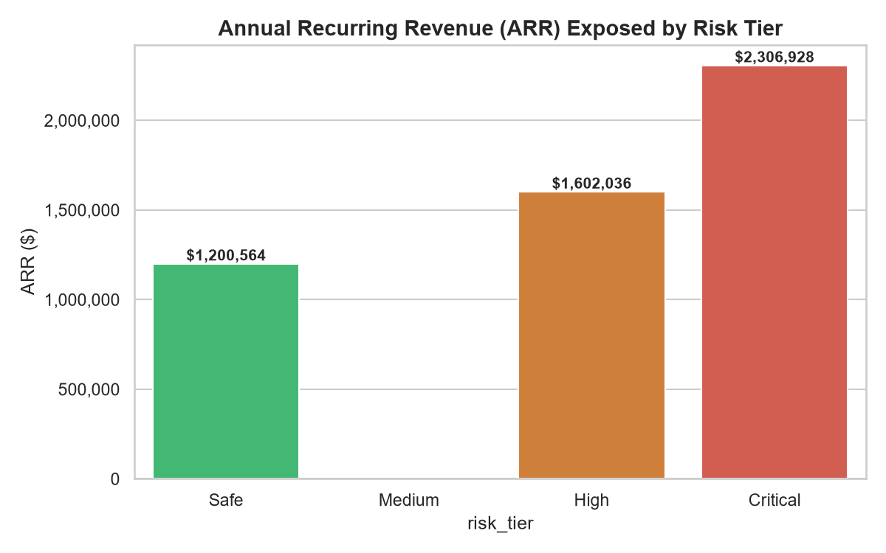
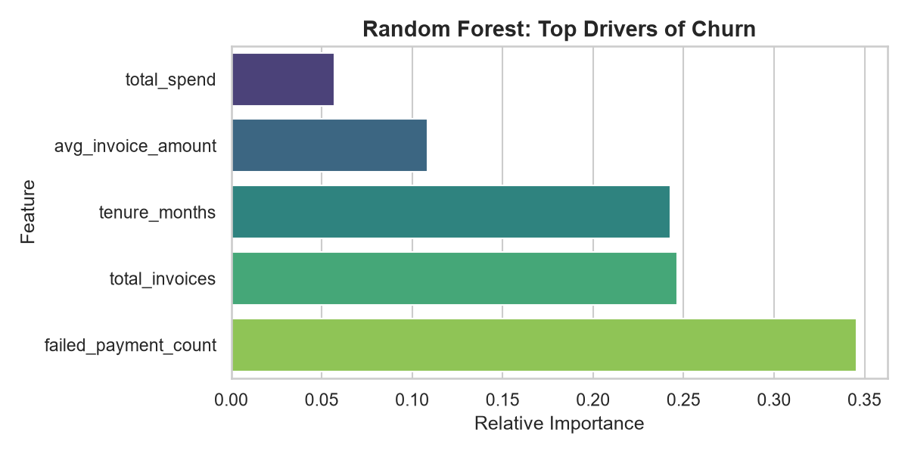
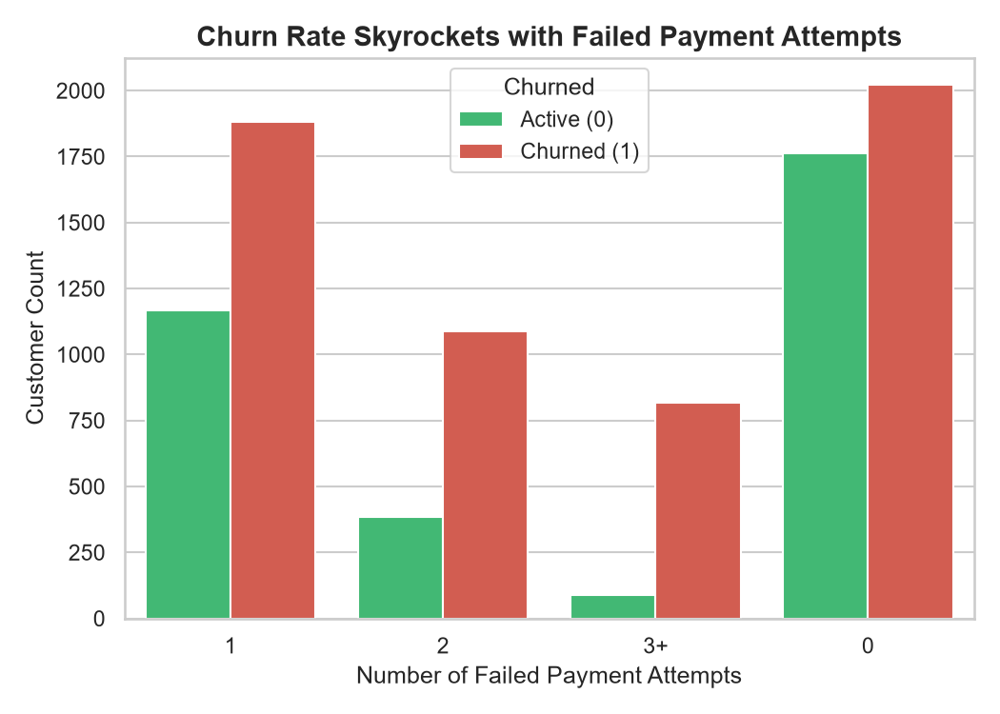
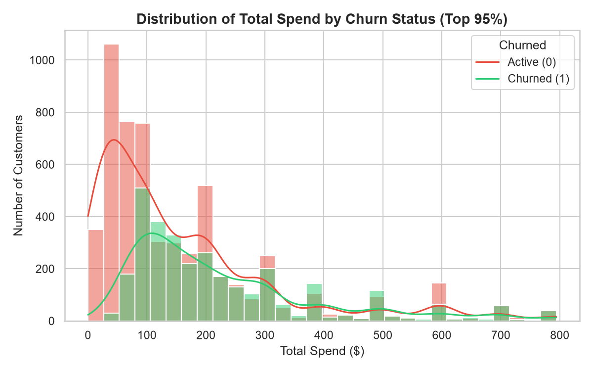
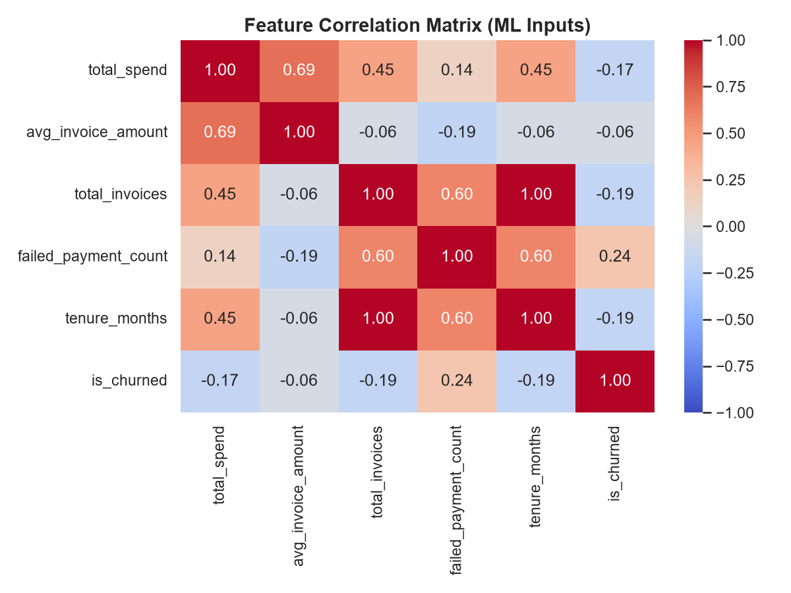
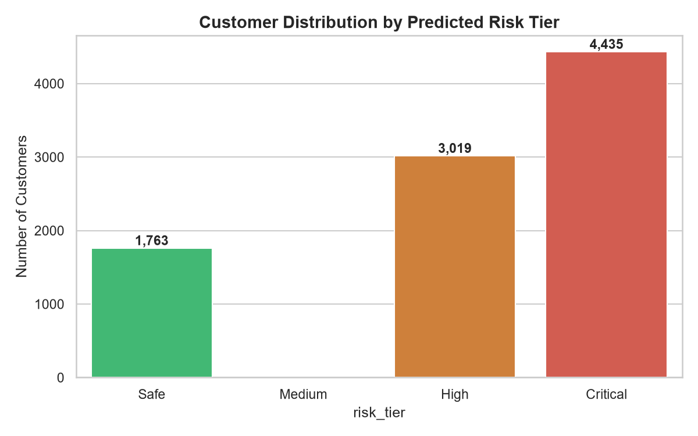

<div align="center">
 &nbsp;&nbsp; 
 &nbsp;&nbsp;

</div>

<h1 align="center">Customer Churn Intelligence API</h1>
<h3 align="center">From Raw Stripe Transactions to a Real-Time Retention Engine Protecting $3.9M in ARR</h3>

<div align="center">


<br><br>
<b>Saswata Ghosh</b><br>
<a href="https://github.com/Saswataghosh06/customer-churn-intelligence-api">GitHub</a> · <a href="https://www.linkedin.com/in/saswata-ghosh06/">LinkedIn</a> · <a href="mailto:saswataghosh2022@gmail.com">Email</a>

<br><br>

**The Business Case:** 
[Executive Summary](#2-executive-summary) · [Key Findings](#3-key-findings-the-data-proves-it) · [Recommendations](#4-strategic-recommendations)<br>
**The Engineering Solution:** 
[System Architecture](#5-system-architecture) · [Tech Stack](#6-tech-stack) · [Run Locally](#7-quick-start)

</div>

---
> **The Headline:** An ML-powered microservice that calculates real-time churn risk scores. By identifying that **failed payment attempts** are the #1 predictor of churn—overwhelming product usage—this system highlights a targeted retention strategy that could protect $3.9M of a $5.1M ARR base.

> **Note:** This is a portfolio project demonstrating production ML engineering, API design, and MLOps. The dataset simulates 12 months of SaaS billing behavior modeled after the Stripe API schema.

---

## 1. The Situation (Business Problem)

For B2B SaaS companies, the billing interface is the most consistent touchpoint with a customer. However, when a customer's credit card fails, or they downgrade their plan, traditional CRMs don't flag this as an immediate churn risk until the subscription is already canceled. 

This project was built to answer three questions that a CEO needs answered in real-time, not at the end of the quarter:
1. How much Annual Recurring Revenue (ARR) is currently at risk?
2. What specific behaviors signal that a customer is about to leave?
3. Can we serve these predictions via an API so internal tools can trigger proactive retention workflows?

---

## 2. Executive Summary

| Metric | Value |
|---|---|
| Total Active Customers Analyzed | **9,217** |
| Total Annual Recurring Revenue (ARR) | **$5,109,528.00** |
| Historical "True" Churn Rate | 63.0% (Aggressive definition: uncollectible/early exit) |
| **Customers Flagged High/Critical Risk** | **7,454 (80.8%)** |
| **ARR Exposed in High/Critical Tiers** | **$3,908,964.00** |
| Best ML Model | Random Forest (Accuracy: 83.7%) |

---

## 3. Key Findings: The Data Proves It

The Machine Learning model and subsequent Exploratory Data Analysis (EDA) revealed three distinct insights that shift the retention strategy away from product features and toward revenue operations.

### 3.1 The Financial Exposure
The model exhibits high decisiveness—it polarizes customers into "Safe" or "Critical" buckets with almost no "Medium" risk. Over 76% of our total ARR sits in the danger zone.

<p align="center">

  <br><sub><em>Figure 1: ARR distribution by predicted risk tier. Over $2.3M sits in the Critical bucket alone, requiring immediate human intervention.</em></sub>
</p>

### 3.2 The Primary Driver: Payment Friction, Not Product
In SaaS, we often assume churn is driven by lack of product usage. This model proves otherwise. `failed_payment_count` (invoices requiring more than one collection attempt) dominates the Random Forest's feature importance at 34%.

<p align="center">

  <br><em>Figure 2: Random Forest feature importance. "Failed Payment Count" outweighs traditional engagement metrics like total spend.</em>
</p>

The raw data validates the model's logic. There is a near-linear relationship between payment failures and churn. The moment a customer experiences card friction, their likelihood of churning skyrockets.

<p align="center">

  <br><sub><em>Figure 3: Churn rate vs. Failed Payment Attempts. The shift from Green (Active) to Red (Churned) is immediate and severe.</em></sub>
</p>

**The Takeaway:** Before investing in complex product analytics, the business should invest in "smart dunning" (automated, polite retry logic for failed credit cards). Fixing the payment pipeline is the highest-leverage retention strategy.

### 3.3 The Behavioral Patterns
To ensure we weren't missing secondary signals, we analyzed the statistical distributions of our customer base.

**The Onboarding Problem:**
The spend distribution reveals a massive spike of churned customers in the $0-$50 range. This isn't a pricing problem; it's a "Time-to-Value" problem. These users signed up for a Basic plan, failed to activate, and left.

<p align="center">

  <br><sub><em>Figure 4: Total spend distribution (Top 95%). Churned customers heavily concentrate in the micro-SMB $0-$50 segment.</em></sub>
</p>

**The Need for Non-Linear Models:**
We analyzed the Pearson correlation matrix of our inputs. Notice that no single feature has a strong linear correlation with churn (all < 0.20). Churn is a *combination* of events. This empirically justifies bypassing simple Logistic Regression in favor of a non-linear ensemble model like Random Forest.

<p align="center">

  <br><sub><em>Figure 5: Feature Correlation Matrix. Weak linear predictors prove that churn boundaries are complex and non-linear.</em></sub>
</p>

### 3.4 Model Decisiveness (Operational Advantage)
Unlike many models that output uncertain probabilities around 0.5, this model forces customers to the edges. 

<p align="center">

  <br><sub><em>Figure 6: Customer distribution. Notice the complete absence of a "Medium" risk tier. The model forces a clear operational decision.</em></sub>
</p>

While 83.7% accuracy seems moderate, the business value lies in its *lack of false positives*. If the system says "Safe", they almost certainly are. This allows the retention team to focus 100% of their expensive human effort on the 7,454 at-risk customers, ignoring the rest.

---

## 4. Strategic Recommendations

| Priority | Action | Expected Impact |
|---|---|---|
| **P1** | Implement automated Stripe Smart Retries for failed payments | Directly attacks the #1 churn driver identified in Fig 2 & 3 |
| **P1** | Build an internal Slack/Email alert webhook triggered by the API | Enables Account Managers to intervene before cancellation |
| **P2** | Offer "Payment Grace Periods" to the 4,435 "Critical" tier customers | Trades short-term cash flow for long-term $2.3M ARR retention |
| **P3** | Implement guided onboarding sequences for the $0-$50 segment | Addresses the early-stage activation failure identified in Fig 4 |

---

## 5. System Architecture

To operationalize these insights, we built a decoupled, containerized microservice architecture. This is not a Jupyter notebook; it is a production system.

```mermaid
graph TD
    subgraph "Phase 1: Data Engineering"
        A[Python ETL Script] -->|Simulates 12 months| B[(PostgreSQL Docker)]
    end

    subgraph "Phase 2: MLOps / Training"
        B -->|Extracts via Pandas| C[Training Script]
        C -->|Logs Params/Metrics| D[(MLflow Server)]
        C -->|Bakes Artifacts| E[model.pkl + scaler.pkl]
    end

    subgraph "Phase 3: Production API"
        E -->|Loaded at Startup| F((FastAPI Docker Container))
        B -->|Async SQL via AsyncPG| F
        F -->|JSON Response| G[Streamlit Dashboard / Client]
    end

    classDef docker fill:#2496ED,color:#fff,stroke:#000
    class B F docker
    classDef mlflow fill:#0194E2,color:#fff,stroke:#000
    class D mlflow
```

---

## 6. Tech Stack

| Layer | Tool | Why |
|---|---|---|
| **API Framework** | FastAPI | Async support, automatic OpenAPI docs, Pydantic validation |
| **Database** | PostgreSQL 15 | Relational integrity for financial transactions |
| **ORM / Driver** | SQLAlchemy 2.0 + AsyncPG | Non-blocking database calls at scale |
| **ML Serving** | Scikit-learn + Joblib | Loaded into RAM at API startup for <10ms latency |
| **MLOps** | MLflow | Experiment tracking, parameter logging |
| **Infrastructure** | Docker & Compose | Local parity with production, isolated networking |

---

## 7. Quick Start

**Prerequisites:** Docker Desktop, Python 3.11+

<details>
<summary><b>Click to expand setup instructions</b></summary>

```bash
# 1. Clone the repo
git clone [YOUR_GITHUB_LINK]
cd customer-churn-api

# 2. Spin up Database & API via Docker
docker-compose up -d --build

# 3. Seed the database with SaaS billing data
pip install -r requirements.txt
python data/generate_stripe_data.py

# 4. View the interactive API docs (Swagger UI)
open http://localhost:8000/docs

# 5. (Optional) View the Streamlit Dashboard
streamlit run frontend/app.py
```
</details>

---

## 8. Engineering Trade-offs

| Decision | Alternative | Why This Choice |
|---|---|---|
| **Baking `.pkl` vs MLflow Runtime** | Query MLflow server on startup | Network calls add latency. Baking ensures the API starts instantly and works offline. |
| **Async SQLAlchemy over Sync** | Standard `psycopg2` | Sync drivers block the event loop. Async allows concurrent DB queries for multiple users. |
| **Time-Bound Churn Definition** | `status == 'canceled'` flag | Prevents target leakage, ensuring the model learns patterns, not just copying a DB column. |

---

##  Deep-Dive Documentation (For Technical Interviews)

<details>
<summary><b>Data Audit & Statistical EDA (For Data Analysts & ML Engineers)</b></summary>
Detailed statistical distributions, correlation matrices, class imbalance analysis, and feature engineering justifications.
<br><br>
<a href="docs/data_audit_eda.md"><b>View Data Audit & EDA Report</b></a>
</details>

<details>
<summary><b>Data Dictionary & DB Schema (For Data Engineers)</b></summary>
Detailed column types, PII classification, constraints, transformation logic, and API payload structures.
<br><br>
<a href="docs/data_dictionary.md"><b>View Data Dictionary</b></a>
</details>

<details>
<summary><b>Technical Architecture & Async Design (For Backend & DevOps)</b></summary>
Request lifecycles, Docker networking pitfalls, the "Bake vs. Serve" MLOps paradigm, and production debugging logs.
<br><br>
<a href="docs/technical_architecture.md"><b>View Architecture Deep-Dive</b></a>
</details>

<details>
<summary><b>Business Insights & Retention Playbook (For PMs & Strategy)</b></summary>
Translating ML outputs into actionable revenue operations strategies, projected ROI of interventions, and tiered retention playbooks.
<br><br>
<a href="docs/business_insights.md"><b>View Business Strategy Doc</b></a>
</details>

---

<p align="center">
  <sub>If you have any question regarding this project feel free to ask me . I will be happy to clarify them</sub>
</p>
```